

  

<h1 align="center">BisPay Revora Payments Revenue</h1>

  <strong>Revenue infrastructure for recurring payments, billing and business operations.</strong>

  
  
  
  
  
  
  
  

  <a href="#-sobre-a-bispay-revora">Sobre</a> •
  <a href="#-arquitetura">Arquitetura</a> •
  <a href="#%EF%B8%8F-technology-stack">Stack</a> •
  <a href="#-authentication">Auth</a> •
  <a href="#-payment-providers">Providers</a> •
  <a href="#-design-principles">Princípios</a>

---

## 🏛️ Sobre a BisPay Revora

A **BisPay Revora Payments Revenue** é um subserviço da **BisPay Gateway**, desenvolvido para centralizar operações relacionadas a **receitas recorrentes, cobranças, pagamentos, clientes e gestão de vendas**.

A Revora foi projetada com uma arquitetura orientada a serviços, processamento assíncrono e integração com múltiplos provedores de pagamento, mantendo o domínio de negócio independente das implementações específicas de cada provider.

A **BisPay Revora** existe como uma camada especializada da infraestrutura da **BisPay Gateway**.

Enquanto a BisPay Gateway atua como infraestrutura de integração e processamento com diferentes meios e provedores de pagamento, a Revora trabalha em uma camada superior, concentrando a lógica necessária para que negócios possam:

- Cadastrar e gerenciar clientes
- Criar e administrar cobranças
- Trabalhar com receitas recorrentes
- Acompanhar pagamentos
- Disponibilizar diferentes métodos de pagamento
- Gerar e acompanhar transações
- Integrar diferentes providers
- Processar eventos e tarefas de forma assíncrona
- Enviar comunicações transacionais
- Controlar operações com segurança e idempotência

A separação permite que a Revora evolua seu domínio de negócio sem acoplar sua aplicação diretamente à implementação interna de cada provedor.

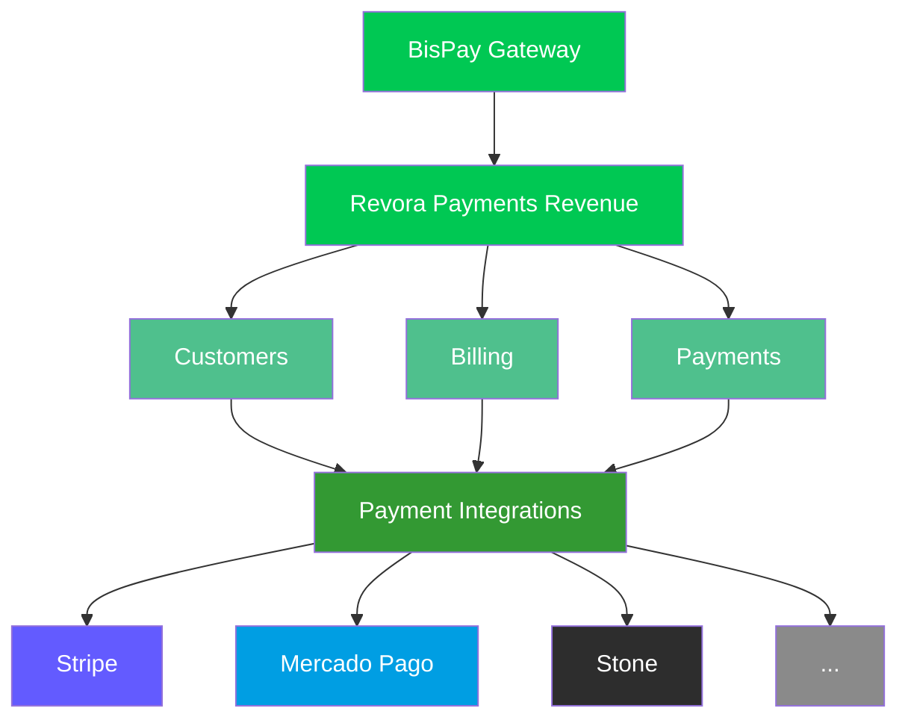

---

## 🧱 Architecture

A Revora utiliza uma arquitetura composta por aplicações especializadas, serviços de domínio, persistência, processamento assíncrono e integrações externas.

O objetivo é manter responsabilidades separadas sem criar abstrações desnecessárias.

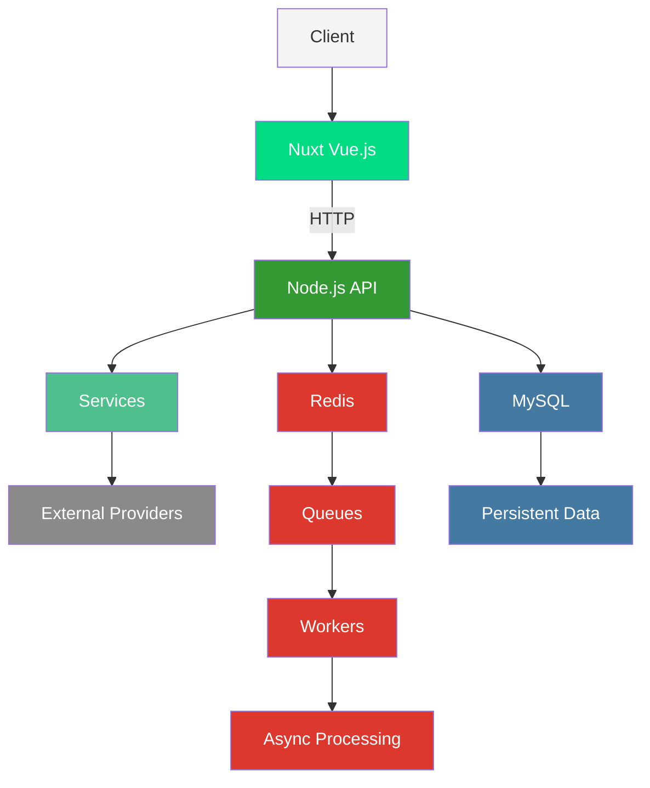

A aplicação é dividida principalmente entre:

| Componente | Responsabilidade |
|------------|------------------|
| **API/Core** | Regras de negócio e exposição HTTP |
| **Services** | Operações de domínio |
| **Workers** | Processamento assíncrono |
| **Queues** | Comunicação entre operações síncronas e assíncronas |
| **MySQL** | Persistência relacional |
| **Redis** | Cache, filas, controle temporário e mecanismos auxiliares |
| **Payment Providers** | Integrações externas |
| **Email Service** | Processamento e envio de comunicações transacionais |

---

## ⚙️ Technology Stack

### Backend

  
  

- Node.js 22.x
- JavaScript / ECMAScript Modules
- HTTP APIs
- Service-oriented application structure
- Workers & Queue processing
- Idempotent operations

### Frontend

  
  

- Vue.js 3.x
- Nuxt 4.x
- Pinia (State Management)
- Axios (HTTP Client)
- Component-driven architecture
- Client-side state management

### Infrastructure

  
  
  

- Docker (Containerized environments)
- Redis (Cache & Queues)
- MySQL (Relational Database)
- Persistent storage
- Environment-based configuration

### Authentication

  

- Password authentication
- Google OAuth integration
- Provider-based identity
- Token validation
- Email verification
- Password recovery & reset
- Session/token based API authentication

---

## 💳 Payment Providers

A Revora foi construída para trabalhar com múltiplos provedores de pagamento.

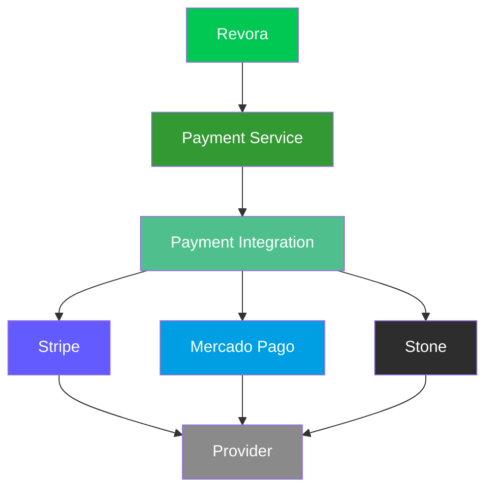

| Provider | Status |
|----------|--------|
| Stripe | Implementado |
| Mercado Pago | Implementado |
| Nubank | Planejado |
| Stone | Implementado |

Cada integração é tratada como uma implementação específica da infraestrutura de pagamentos, enquanto a Revora mantém seus próprios conceitos de:

- **Payment** — Pagamento
- **Transaction** — Transação
- **Customer** — Cliente
- **Billing** — Cobrança
- **Status** — Estado da operação
- **Idempotency** — Controle de duplicidade
- **Provider Reference** — Referência externa

---

## 🔐 Authentication

### Password

Fluxo completo de autenticação por senha:

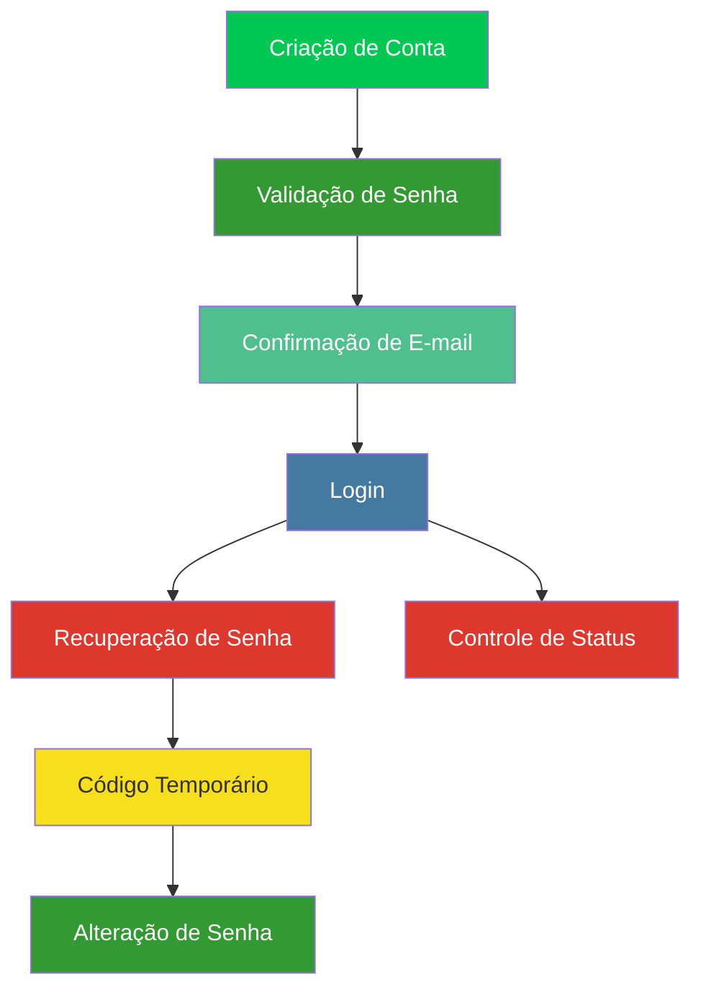

### Google OAuth

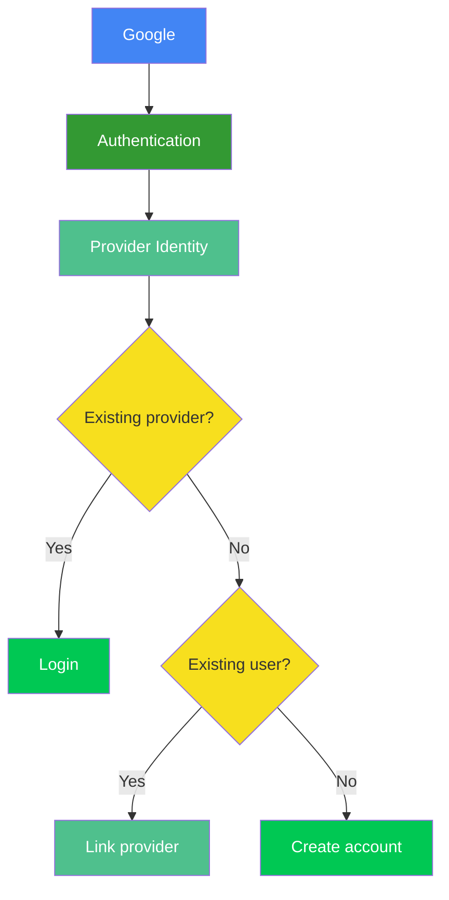

A identidade do provider é separada do e-mail como mecanismo de identificação, evitando depender do endereço de e-mail como identificador permanente da conta externa.

---

## 📬 Email Infrastructure

O envio de e-mails é desacoplado da requisição HTTP principal.

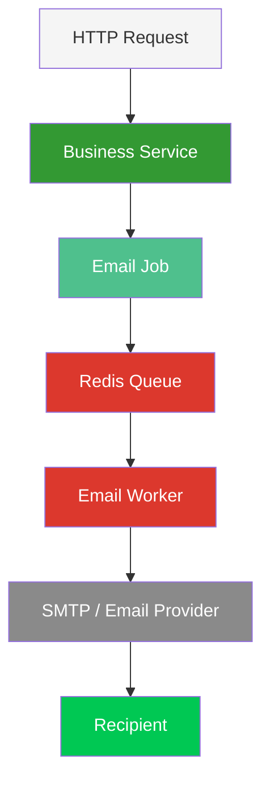

Isso evita que operações como criação de conta, recuperação de senha, confirmação de e-mail e notificações de pagamento fiquem bloqueadas aguardando o envio do e-mail.

---

## ⚡ Redis

O Redis é utilizado como infraestrutura de alta velocidade para informações temporárias e processamento assíncrono.

| Uso | Descrição |
|-----|-----------|
| Filas | Comunicação entre processos |
| Jobs | Tarefas assíncronas |
| Dados temporários | Informações de curta duração |
| Códigos de recuperação | Tokens temporários |
| Controle de expiração | TTL e validade |
| Cache | Aceleração de consultas |
| Concorrência | Locks e controles |

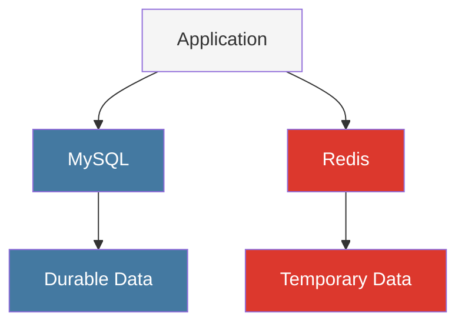

---

## 📨 Queues & Workers

Operações que não precisam ser concluídas dentro do ciclo imediato da requisição podem ser processadas através de filas.

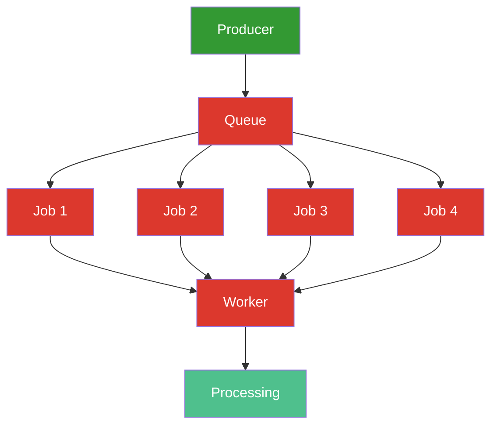

Exemplos de uso:

- Envio de e-mail
- Processamento de notificações
- Tarefas de integração
- Processamento de eventos
- Operações externas que podem ser reprocessadas

---

## 🔁 Idempotency

Operações financeiras precisam considerar que uma mesma solicitação pode ser recebida mais de uma vez.

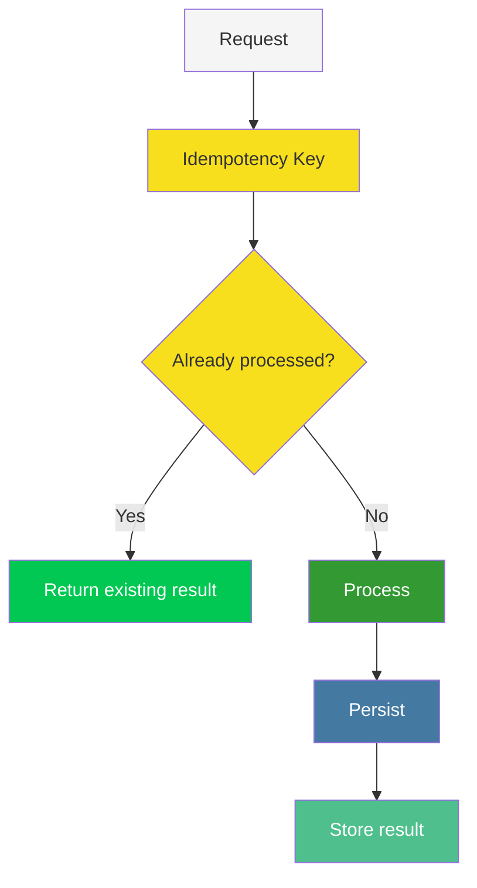

A idempotência reduz o risco de duplicidade quando existem retries, timeouts, falhas de rede, reprocessamento de jobs e callbacks duplicados.

---

## 🔄 Retry & Failure Handling

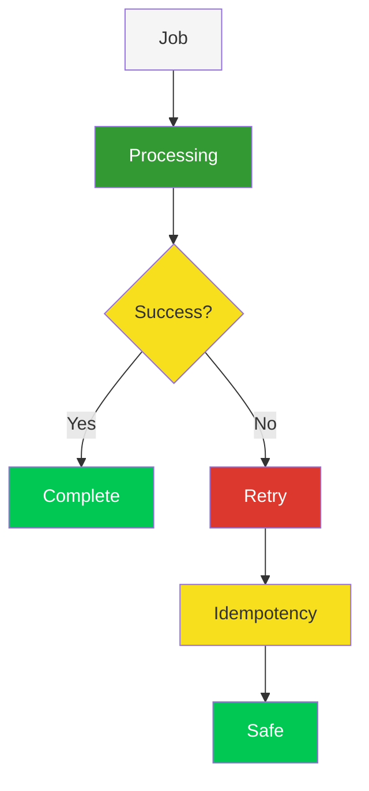

**Retry e idempotência trabalham juntos.** Um retry não deve transformar uma operação financeira em uma segunda operação financeira.

---

## 🗄️ MySQL

O MySQL é responsável pela persistência dos dados permanentes da aplicação.

| Entidade | Descrição |
|----------|-----------|
| Users | Usuários do sistema |
| Authentication Providers | Provedores de identidade |
| Accounts | Contas de negócio |
| Account Members | Membros das contas |
| Customers | Clientes |
| Quotes / Quote Items | Orçamentos |
| Payments | Pagamentos |
| Payment Integrations | Integrações de pagamento |
| Payment Transactions | Transações |
| Credentials | Credenciais |
| Email Verification | Verificação de e-mail |
| User Profiles | Perfis de usuário |

A aplicação utiliza relacionamentos e constraints do banco para preservar a integridade dos dados. Identificadores internos utilizam UUIDs binários, enquanto chaves técnicas e índices são estruturados para favorecer operações eficientes.

---

## 👤 User Profiles & Media

Dados de autenticação e dados de apresentação são separados:

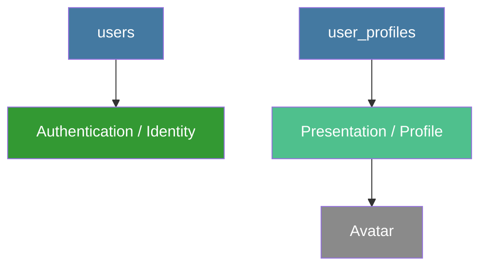

Fluxo de processamento de imagem:

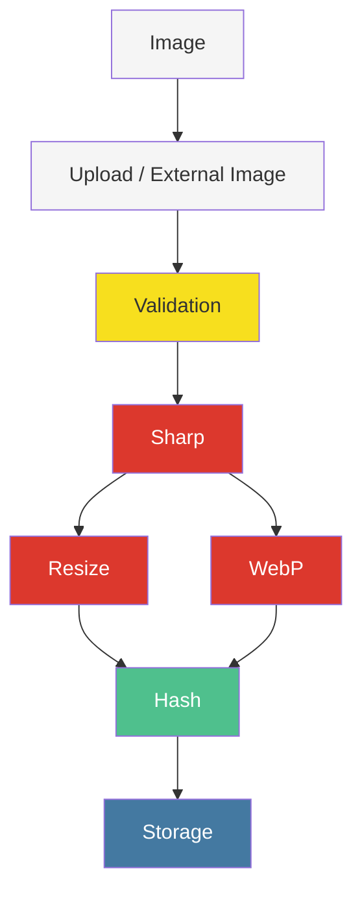

---

## 🐳 Docker

O ambiente de infraestrutura pode ser executado de forma containerizada utilizando Docker.

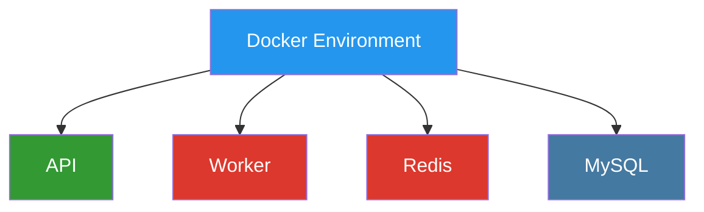

A aplicação utiliza variáveis de ambiente para separar configurações de desenvolvimento, homologação e produção.

---

## 🧠 Design Principles

| Princípio | Descrição |
|-----------|-----------|
| **Separation of Concerns** | Cada camada possui uma responsabilidade específica |
| **Idempotency First** | Operações que podem ser repetidas devem considerar reexecução |
| **Async When Necessary** | Operações secundárias não devem bloquear operações críticas |
| **Database Integrity** | A consistência deve ser protegida pela aplicação e pelo banco |
| **Provider Independence** | O domínio não deve depender de um único gateway |
| **Explicit Architecture** | Código explícito e previsível em vez de abstrações excessivas |
| **Fail Safely** | Falhas externas devem ser tratadas sem comprometer o estado interno |

---

## 🚀 Project Status

A **BisPay Revora Payments Revenue** está em desenvolvimento.

Foco inicial:

- Gestão de clientes
- Cobranças e pagamentos
- Receitas recorrentes
- Autenticação
- Integração com providers
- Infraestrutura de pagamentos
- Processamento assíncrono
- Comunicação transacional

Novos módulos serão adicionados conforme o domínio da plataforma evoluir.

---

## 🗺️ Roadmap

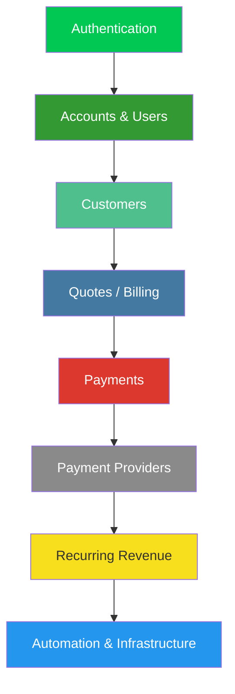

A arquitetura foi concebida para permitir que novos módulos sejam incorporados sem alterar o núcleo dos módulos existentes.

---

## 📁 Repository Philosophy

A Revora não é apenas uma interface sobre gateways de pagamento. Ela representa uma camada de negócio responsável por organizar o ciclo de receita de uma empresa, utilizando a infraestrutura da **BisPay Gateway** para conectar operações financeiras a diferentes providers.

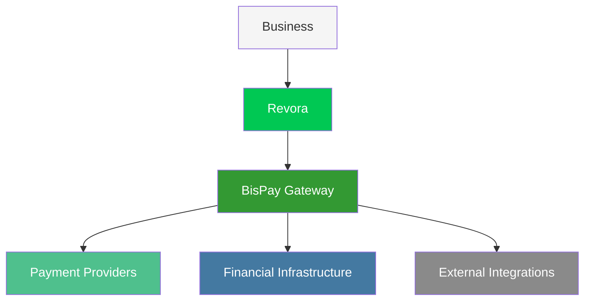

---

  <strong>BisPay Revora</strong> 
  <em>Payments. Revenue. Infrastructure.</em>

  Built with 
  
  
  
  
  
  
  

